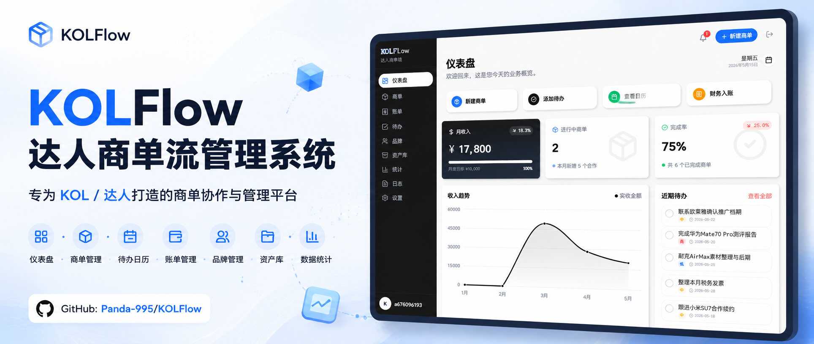
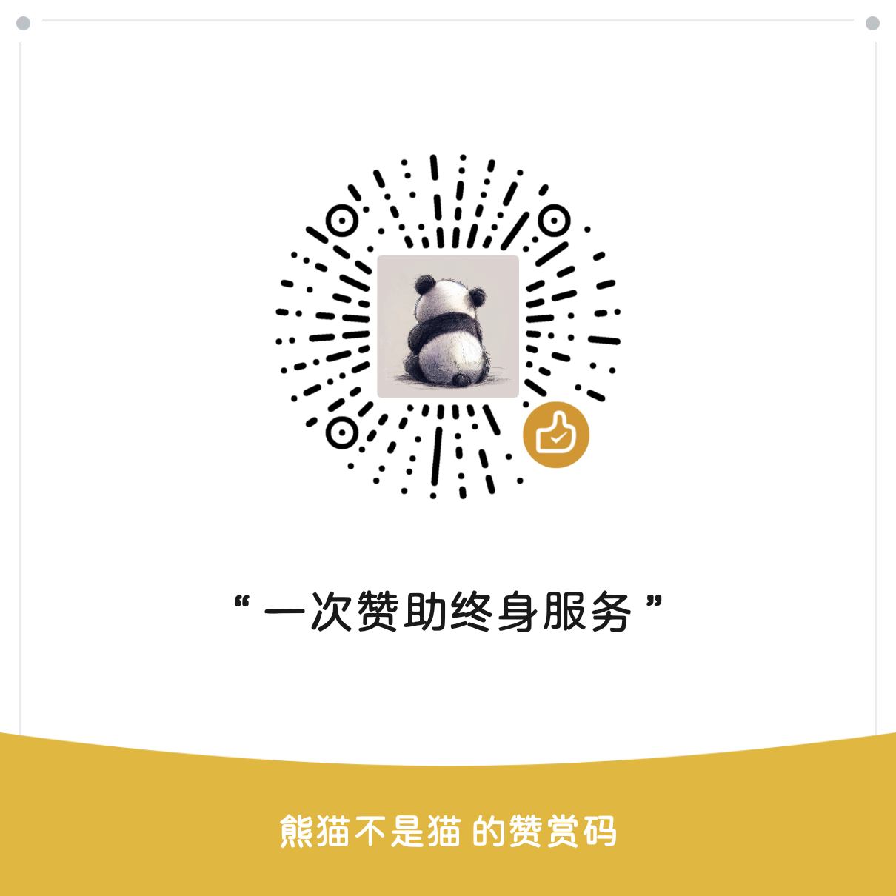

# KOLFlow

<p align="center">
  
</p>

<p align="center">
  <strong>达人商单流管理系统</strong><br>
  <sub>KOL Business Collaboration Management System</sub>
</p>

<p align="center">
  <strong>轻松管理每一笔合作，让商单管理更高效</strong><br>
  <sub>Efficient business collaboration tracking for KOLs</sub>
</p>

<p align="center">
  <a href="#features">Features</a> •
  <a href="#getting-started">Getting Started</a> •
  <a href="#tutorial">Tutorial</a> •
  <a href="#android-app">Android App</a> •
  <a href="#deployment">Deployment</a> •
  <a href="#api-docs">API Docs</a> •
  <a href="#tech-stack">Tech Stack</a> •
  <a href="#-更新日志--changelog">Changelog</a>
</p>

<p align="center">
  
  
  <a href="LICENSE">
    
  </a>
</p>

---

<a id="tutorial"></a>

## Tutorial | 使用教程

值得买详细教程：[KOLFlow 达人商单管理系统使用教程](https://post.smzdm.com/p/a6zg63m0/)

---

<a id="features"></a>

## Features | 功能特性

| Feature | 功能 |
|---------|------|
| 📊 Dashboard | 📊 仪表盘 |
| 📦 Order Management | 📦 商单管理 |
| ✅ Todo & Calendar | ✅ 待办/日历 |
| 💰 Billing | 💰 账单管理 |
| 🏢 Brand Management | 🏢 品牌管理 |
| 🎁 Asset Library | 🎁 资产库 |
| 📈 Analytics | 📈 数据统计 |
| 📋 Activity Logs | 📋 操作日志 |
| � Paid Promotion Tracking | 📢 付费推广追踪 |
| � API Key Management | 🔐 API Key 管理 |
| 🎨 Themes | 🎨 主题外观 |
| 📱 Android App | 📱 Android 客户端 |

### Data Linkage | 数据联动

KOLFlow 以商单详情作为主数据。商单会向下同步待办、账单和资产；账单、资产、待办也可以独立存在和独立修改，它们的编辑或删除不会反向修改或删除商单。

| Action | 操作 | Effect | 效果 |
|--------|------|--------|------|
| Create Order | 创建商单 | Auto-create Todo | 自动创建待办 |
| Complete Order (Paid/Direct) | 商单完成（付费/直发） | Create or update Bill | 创建或更新关联账单 |
| Complete Order (Exchange/E-card) | 商单完成（置换/E卡） | Create or update Asset | 创建或更新关联资产 |
| Edit completed Order | 修改已完成商单 | Sync Bill/Asset from order fields | 按商单详情同步账单/资产的品牌、金额、商品信息 |
| Change Order type/status | 修改商单类型/状态 | Rebuild matching derived data | 按商单状态和类型重建对应下游数据 |
| Delete Order | 删除商单 | Delete related generated data | 删除关联账单、资产、待办、发布链接、评论和推广记录 |
| Delete Brand | 删除品牌 | Clear brand info | 品牌信息置空 |
| Mark Asset as Sold | 资产标记已出 | Update brand income, reflect in dashboard/analytics | 更新品牌收入，计入仪表盘和统计 |
| Edit/Delete Bill, Asset, Todo | 编辑/删除账单、资产、待办 | Do not change Order | 不反向修改或删除商单 |
| Import old backup | 导入旧版备份 | Backfill missing derived data | 按商单自动补齐旧数据缺失的账单、资产和待办 |

---

<a id="getting-started"></a>

## Getting Started | 快速开始

### Requirements | 环境要求

- **Node.js >= 20.19.0** or **>= 22.12.0**
- npm >= 9
- Android App build only | 仅构建 Android App 需要：
  - JDK 21+
  - Android Studio / Android SDK

> **Note**: Due to `@vitejs/plugin-react@5.x`, Node.js version must be >= 20.19.0.

### Installation | 安装

```bash
git clone https://github.com/Panda-995/KOLFlow.git
cd KOLFlow
npm install
```

### Configuration | 配置

Create `.env` file:

```env
NODE_ENV=production
PORT=3000
JWT_SECRET=your-secret-key-here
INVITE_CODE=your-invite-code
CORS_ORIGIN=*
DATA_DIR=./data
```

### Run | 运行

```bash
# Development | 开发模式
npm run dev

# Production | 生产构建
npm run build
npm run build:server
NODE_ENV=production node build/server.js
```

Windows PowerShell production example:

```powershell
npm run build
npm run build:server
$env:NODE_ENV = "production"
node build/server.js
```

The development server listens on `0.0.0.0:3000`, so devices on the same LAN can access it through:

```text
http://<your-computer-lan-ip>:3000
```

### First Use | 首次使用

1. Visit http://localhost:3000
2. Click "注册账号" (Register)
3. Enter email, password, and invite code

---

<a id="android-app"></a>

## Android App | Android 客户端

KOLFlow provides a Capacitor-based Android app. The mobile app reuses the same backend and most of the same Web UI. On the login screen, the app asks for a server address first, then uses the account/password from that server to sign in.

### Server Address | 服务端地址

Use an HTTPS address that the phone can actually reach and whose certificate is valid:

| Device | 服务端地址示例 |
|--------|----------------|
| Android emulator / test device | `https://kolflow-test.example.com` |
| Real Android phone | `https://kolflow.example.com` |

The Android app rejects HTTP, `localhost`, `127.0.0.1`, and `0.0.0.0` to prevent email, password, invite-code, and business data from being sent in clear text. Configure a trusted TLS certificate and use its HTTPS domain.

### Build APK | 构建 APK

```bash
# Build web assets and sync native project
npm run cap:sync

# Build Android debug APK
cd android
./gradlew assembleDebug
```

Windows PowerShell example:

```powershell
npm run cap:sync
cd android
.\gradlew.bat assembleDebug
```

If Gradle reports that Java 8 is being used, set `JAVA_HOME` to a JDK 21+ installation before building.

Example with Temurin JDK 21 on Windows:

```powershell
$env:JAVA_HOME = "C:\Program Files\Eclipse Adoptium\jdk-21.0.11.10-hotspot"
$env:Path = "$env:JAVA_HOME\bin;$env:Path"
.\gradlew.bat assembleDebug
```

The debug APK will be generated at:

```text
android/app/build/outputs/apk/debug/app-debug.apk
```

### Mobile Notes | 移动端说明

- App name: `KOLFlow`
- App icon source: `public/app.png`
- Android cleartext traffic is disabled; the app only accepts HTTPS backend addresses with valid certificates.
- The APP download/update link shown in “设置－关于项目” can be overridden at build time with `VITE_APP_DOWNLOAD_URL`.

---

<a id="deployment"></a>

## Deployment | 部署

### Docker (Recommended) | Docker 部署（推荐）

支持多架构镜像：amd64 (x86_64) 和 arm64 (Apple Silicon, 树莓派等)

```bash
# 拉取并启动（自动选择对应架构）
docker compose up -d

# 如果使用旧版 Docker Compose
docker-compose up -d

# 或手动指定镜像
docker run -d -p 3000:3000 \
  -e JWT_SECRET=your-secret \
  -e INVITE_CODE=your-code \
  ghcr.io/panda-995/kolflow:latest
```

**镜像标签**:

| Tag | 说明 |
|-----|------|
| `latest` | 最新版（多架构） |
| `arm64` | ARM64 架构专用 |
| `amd64` | x86_64 架构专用 |

Set environment variables | 设置环境变量:
```bash
export JWT_SECRET=your-secret-key
export INVITE_CODE=your-invite-code
# 默认允许 HTTP/HTTPS 域名、局域网和 App 访问；如需收紧可改为逗号分隔域名
export CORS_ORIGIN=*
# 已在可信 HTTPS 反向代理后部署时，开启服务端 API 明文访问拦截
export ENFORCE_HTTPS=true
docker compose up -d
```

`ENFORCE_HTTPS=true` 依赖反向代理正确传递 `X-Forwarded-Proto: https`。直接通过容器 HTTP 端口访问时不要开启；合规公开部署应先配置 HTTPS 反向代理，再开启该选项。

GitHub Actions 会优先发布 GHCR 镜像；Docker Hub 只有配置了 `DOCKER_HUB_USERNAME` 和 `DOCKER_HUB_TOKEN` secrets 时才会同步发布。如果拉取镜像提示 `manifest unknown`，先确认镜像名为全小写：

```bash
docker pull ghcr.io/panda-995/kolflow:latest
```

若刚推送代码，请等待 GitHub Actions 中 `merge-manifest` 步骤完成；如果使用旧版 Docker、NAS 面板或镜像代理仍无法拉取，可临时指定架构标签：

```bash
# x86_64 / AMD64 设备
docker pull ghcr.io/panda-995/kolflow:amd64

# ARM64 设备
docker pull ghcr.io/panda-995/kolflow:arm64
```

---

<a id="api-docs"></a>

## API Docs | API 文档

除 `/api/health`、注册、登录和用户检查外，内部业务 API 需要 Bearer Token 认证（`Authorization: Bearer <token>`）。

### Authentication | 认证

```bash
GET  /api/health               # 健康检查
GET  /api/auth/check-users     # 检查是否已有用户
POST /api/auth/register        # 注册  Body: { email, password, inviteCode, privacyAccepted: true }
POST /api/auth/login           # 登录  Body: { email, password, privacyAccepted: true }
POST /api/auth/verify           # 验证 Token
DELETE /api/settings/account    # 永久注销账号  Body: { password }
```

### Orders | 商单

```bash
GET    /api/orders              # 获取全部商单
POST   /api/orders              # 创建商单（自动创建待办）
PUT    /api/orders/:id          # 更新商单（自动同步账单/资产/待办）
DELETE /api/orders/:id          # 删除商单（级联删除关联数据）
```

### Payments | 账单

```bash
GET    /api/payments            # 获取全部账单
POST   /api/payments            # 创建账单
PUT    /api/payments/:id        # 更新账单
DELETE /api/payments/:id        # 删除账单
```

### Brands | 品牌

```bash
GET    /api/brands              # 获取全部品牌
GET    /api/brands/:id          # 获取单个品牌
POST   /api/brands              # 创建品牌
PUT    /api/brands/:id          # 更新品牌（支持多联系人）
DELETE /api/brands/:id          # 删除品牌（清理关联商单品牌信息）
```

### Assets | 资产

```bash
GET    /api/assets              # 获取全部资产
GET    /api/assets/:id          # 获取单个资产
PUT    /api/assets/:id          # 更新资产（名称、价值、售卖状态、图片）
DELETE /api/assets/:id          # 删除资产（已出资产自动扣减品牌收入）
```

### Todos | 待办

```bash
GET    /api/todos               # 获取全部待办
POST   /api/todos               # 创建待办
PUT    /api/todos/:id/update    # 更新待办
PUT    /api/todos/:id/toggle    # 切换完成状态
DELETE /api/todos/:id           # 删除待办
```

### Comments | 评论

```bash
GET    /api/comments/:orderId   # 获取商单评论
POST   /api/comments            # 添加评论  Body: { orderId, content }
DELETE /api/comments/:id        # 删除评论
```

### Logs | 操作日志

```bash
GET    /api/logs                # 获取操作日志（最近100条）
DELETE /api/logs                # 清空操作日志
```

### Publish Links | 发布链接

```bash
GET    /api/publish-links/:orderId    # 获取商单发布链接
POST   /api/publish-links             # 添加发布链接  Body: { orderId, url, platform? }
POST   /api/publish-links/batch       # 批量添加发布链接
PUT    /api/publish-links/:id         # 更新发布链接
DELETE /api/publish-links/:id         # 删除发布链接
```

### Paid Promotions | 付费推广

```bash
GET    /api/paid-promotions?orderId=:orderId   # 获取商单付费推广记录
POST   /api/paid-promotions                    # 添加付费推广记录  Body: { orderId, platform, amount }
DELETE /api/paid-promotions/:id                 # 删除付费推广记录
```

### Data Import/Export | 数据导入导出

```bash
GET    /api/data/export          # 导出当前用户全部数据（JSON）
POST   /api/data/import          # 导入完整备份数据（JSON）
POST   /api/data/orders          # JSON 批量导入商单
POST   /api/data/orders/file     # Excel/CSV 文件导入商单（multipart/form-data）
POST   /api/data/clear           # 清空当前用户业务数据
```

### Settings | 设置

```bash
GET    /api/settings            # 获取用户设置
PUT    /api/settings            # 更新用户设置（主题、头像、昵称、API Key 等）
PUT    /api/settings/security   # 更新邮箱/密码（修改密码必须提供 oldPassword）
POST   /api/settings/apikey     # 生成 API Key
PUT    /api/settings/display    # 更新显示设置
```

### Reports | 报表

```bash
GET    /api/report/:type        # 获取指定类型统计报表
```

### External API | 外部 API（API Key 鉴权）

```bash
GET    /api/external/orders?token=<API_KEY>          # 获取商单列表
POST   /api/external/orders?token=<API_KEY>          # 创建商单
PUT    /api/external/orders/:id?token=<API_KEY>      # 更新商单
DELETE /api/external/orders/:id?token=<API_KEY>      # 删除商单
GET    /api/external/todos?token=<API_KEY>           # 获取待办列表
GET    /api/external/payments?token=<API_KEY>        # 获取账单列表
GET    /api/external/brands?token=<API_KEY>          # 获取品牌列表
GET    /api/external/statistics?token=<API_KEY>      # 获取统计数据
GET    /api/external/export?token=<API_KEY>          # 导出数据（包含商单、账单、品牌、资产、推广记录等）
```

External order create/update supports `productName` and `productValue`. When an Exchange/E-card order is marked as completed through the external API, KOLFlow will create the related Asset automatically.

---

<a id="tech-stack"></a>

## Tech Stack | 技术栈

| Category | 分类 | Tech | 技术 |
|----------|------|------|------|
| Frontend | 前端 | React 19, TypeScript, Tailwind CSS |
| Backend | 后端 | Express, better-sqlite3 |
| State | 状态 | Zustand |
| Charts | 图表 | Recharts |
| UI | 组件 | Lucide React, Motion |
| Data | 数据处理 | read-excel-file / csv-parse (商单文件导入), multer (文件上传) |
| Security | 安全 | bcrypt, JWT, helmet, express-rate-limit |
| Mobile | 移动端 | Capacitor (Android) |
| Deployment | 部署 | Docker, Vercel |

---

## 📝 更新日志 | Changelog

### 2026-07-17

- **合规入口补全**: “设置－关于项目”新增隐私政策、个人信息“双清单”、投诉举报、隐私负责人邮箱和 APP 下载/更新入口；下载地址支持通过 `VITE_APP_DOWNLOAD_URL` 在构建时替换。
- **隐私政策细化**: 按业务功能逐项说明个人信息处理目的、方式、范围及必要性，补充运营者基本情况、已收集个人信息清单、第三方共享清单、用户权利和投诉举报渠道。
- **账号注销落地**: “设置－账号安全”新增密码验证与二次确认的永久注销入口，服务端事务删除账号及其全部关联业务数据。
- **HTTPS 传输加固**: Android 关闭明文网络流量并仅接受有效 HTTPS 服务地址；生产部署可通过 `ENFORCE_HTTPS=true` 拒绝 HTTP API 请求。
- **绿联双架构重建**: 重新构建并发布 `amd64`、`arm64` 镜像及多架构 `latest` 清单，并基于新镜像生成 UGOS Pro 双架构 `1.3.0.0004` 应用包。
- **Release 资产更新**: GitHub Release 更新为 `1.3.0.0004` 双架构 UPK 与当前 Android APK；绿联构建工作流新增可选 Release 发布参数，避免构建产物只保留在 Actions Artifacts。

### 2026-06-30

- **绿联 NAS / UGOS Pro 包更新**: 重新打包 UGOS Pro 应用安装包 `1.3.0.0003`，提供 `amd64` 与 `arm64` 两个 UPK 文件，并已同步上传到 GitHub Release。
- **绿联内打开 404 修复**: 将绿联 Docker 应用的 `open_type` 从 `inner` 调整为 `tab`，避免在绿联应用中心直接打开时走系统内置 nginx 页面导致 `404 Not Found`；安装新版后会通过应用端口打开 KOLFlow。
- **发布信息补全**: UPK 包继续保留许可协议、源码链接、隐私政策字段，图标沿用项目原始 `public/app.png`，未生成新图标；Release Notes 已补充 SHA-256 校验信息。

### 2026-06-24

- **隐私政策确认**: 登录与注册必须阅读并勾选隐私政策，前端提交和服务端认证接口均执行校验
- **登录限流调整**: 登录与注册接口由每 15 分钟 5 次调整为最多 60 次失败尝试，成功请求不计入限制
- **资产库图片优化**: 资产列表不再一次性传输全部原图，图片按可视区域加载；新上传图片会自动缩放并压缩为 WebP
- **开源协议更新**: 项目改用 GNU Affero General Public License v3.0（AGPL-3.0-only）
- **作者名称统一**: 项目作者名称统一为“熊猫不是猫QAQ”
- **Android 版本更新**: 应用版本升级至 1.3.0，并重新构建 Android APK

### 2026-06-05

- **单向数据联动规则**: 明确以商单详情为主数据，商单变更会同步关联待办、账单和资产；账单、资产、待办可独立存在，编辑或删除不会反向修改或删除商单
- **商单派生数据修复**: 已完成商单修改品牌、金额、商品名称或商品价值时，会按商单详情同步关联账单/资产；类型或状态变更会按当前商单重新整理对应下游数据
- **商单 API 兼容修复**: 内部创建/更新商单接口补齐 `status` 和 `expectedAmount` 字段传递，接口直接创建已完成商单时也会正确触发账单或资产同步
- **旧版导入兼容增强**: 旧备份缺少账单、资产或待办时，导入后会按商单自动补齐；表格/JSON 商单导入统一字段映射和数据补齐逻辑
- **安全与稳定性修复**: 修复账号安全接口未登录访问可能导致服务端崩溃的问题；账单结算不再覆盖备注字段；API Key 生成失败会正确抛出错误
- **统计口径统一**: 品牌收入排行和报告收入统一按已结算账单与已售资产计算，不再直接使用已完成商单金额作为收入
- **访问与 Docker 部署优化**: CORS 默认支持 HTTP/HTTPS 域名、局域网和 Android App 访问；Docker GitHub Actions 优先发布 GHCR，Docker Hub 改为配置 secrets 后可选同步
- **前端细节修复**: 导出文件释放 Blob URL，复制功能优先使用 Clipboard API，日历周起始日统一为周一，品牌新增失败会正确反馈
- **验证记录**: 已通过 TypeScript 检查、前端构建、服务端构建、依赖审计和临时生产实例 API 流程测试

### 2026-06-04

- **安全依赖修复**: 升级 `react-router-dom` / `react-router` 到 `7.16.0`，官方 npm registry 审计结果为 `0 vulnerabilities`
- **密码修改加固**: 服务端强制要求修改密码时提供并校验 `oldPassword`，避免绕过前端直接改密
- **旧数据导入兼容**: 导入发布链接、评论、付费推广记录时会校验并映射有效商单 ID，旧备份缺少关联商单时自动跳过无效记录，避免整次导入失败
- **外部 API 同步增强**: 外部商单接口支持 `productName` / `productValue`，完成置换/E卡商单时自动创建资产；外部导出接口新增 `assets`
- **字段清空修复**: 商单更新支持清空品牌、接单日期、提交日期、平台列表，并支持金额更新为 `0`；外部账单接口同样支持金额清零与字段清空
- **资产事务修复**: 资产新建、更新、删除与品牌收入调整改为事务处理，降低资产状态和品牌收入不一致风险
- **月报范围修复**: 月报统计范围改为本月 1 日至当天，并使用本地日期格式，避免时区导致日期偏移
- **Android 安全与构建**: Android 关闭自动备份，减少本地敏感存储被系统备份带走的风险；已执行 `npm run cap:sync` 并重新构建 Debug APK

### 2026-05-31

- **资产库手动新建**: 资产库新增“新建资产”，支持手动录入资产名称、品牌、价值和售卖状态；手动资产会自动生成资产编号并兼容旧版数据结构
- **资产品牌选择修复**: 新建资产品牌选择改为可见下拉列表，支持选择已有品牌、不关联品牌或手动输入品牌
- **通知中心增强**: 通知中心新增一键清除全部通知，并修复通知面板点击关闭逻辑导致按钮不稳定的问题
- **搜索与筛选增强**: 账单、商单、资产库统一增强搜索、品牌筛选和年月筛选；账单按创建日期筛选，商单按接单日期筛选，资产按创建日期筛选
- **筛选统计联动**: 账单金额统计和资产总价值会随当前搜索、品牌与年月筛选实时联动
- **数据导入兼容**: 导入旧版备份时兼容 `publishDate/deadline`、字符串平台、旧账单状态和资产旧字段，避免升级后筛选数据缺失
- **安全依赖修复**: 替换无修复版本的 `xlsx` 解析链路，商单文件导入改为支持 `.xlsx` / `.csv`，并修复旧资产缺少 `orderId` 时无法导入的问题
- **安全审计验证**: 使用官方 npm registry 执行 `npm audit --audit-level=moderate`，当前依赖审计结果为 `0 vulnerabilities`
- **Android App 构建**: 已重新同步 Capacitor Android 工程并构建 Debug APK，移动端包含本次资产库、筛选和通知更新
- **Android 构建升级**: Capacitor 升级到 v8，Android 构建链路升级到 Gradle 8.13 / Android Gradle Plugin 8.13，构建环境改为 JDK 21+
- **Android 构建验证**: 使用 JDK 21 + Gradle 8.13 完成 Debug APK 构建验证，生成 `android/app/build/outputs/apk/debug/app-debug.apk`
- **Docker 构建加固**: GitHub Actions Docker 发布增加 manifest/pull 校验并提升旧版 Docker/NAS 拉取兼容性，README 补充 `manifest unknown` 排查说明

### 2026-05-30

- **付费推广追踪**: 新增付费推广模块，支持记录每个商单在不同平台的付费推广费用
- **商单详情页增强**: 商单弹窗详情页新增付费推广记录面板，支持添加/删除推广记录，自动关联平台选项
- **统计分析扩展**: 仪表盘新增付费推广费用卡片，趋势图增加推广成本折线，月度统计包含推广费用维度
- **报表 API 增强**: 统计报表接口返回付费推广数据（`paidPromotionTotal`、`paidPromotions`），支持按年月/品牌筛选
- **导入导出兼容**: 数据导入导出包含付费推广记录，支持完整数据迁移
- **外部 API 更新**: 外部 API 接口同步支持付费推广数据
- **数据库扩展**: 新增 `paid_promotions` 表（id, orderId, userId, platform, amount, createdAt）

### 2026-05-21

- **年月筛选**: 商单页面新增按年/月查看功能，月份筛选依据接单日期；账单页面新增按年/月查看功能，月份筛选依据账单创建日期
- **账单统计联动**: 账单页已结算、待结算、总金额和列表会随年份/月度筛选同步变化
- **Android 构建更新**: 已重新构建 Web 资源并同步到 Android 工程，移动端包包含最新筛选功能
- **README 展示调整**: 将项目使用教程提前到顶部区域，并补充作者公众号与什么值得买主页

### 2026-05-20

- **Android App**: 新增 Capacitor Android 客户端，App 端登录支持填写服务端地址，复用 Web 端账号体系
- **局域网访问**: 服务端监听 `0.0.0.0:3000`，支持同一局域网手机浏览器和 App 访问
- **移动端网络修复**: App 内普通接口和文件导入走 Capacitor 原生 HTTP 能力，减少 WebView 网络限制导致的连接失败
- **App 图标与名称**: Android App 名称为 `KOLFlow`，图标使用 `public/app.png`
- **数据清空稳定性**: 清空数据改为事务处理，并确保 SQLite 外键约束在异常时恢复
- **生产错误响应**: 生产服务补充统一 JSON 错误处理中间件，避免 API 异常返回 HTML 错误页
- **文档更新**: 补充 Android 构建、服务端地址、局域网访问和数据导入导出接口说明

### 2026-05-15

- **资产收入统计**: 资产库已出金额全面计入收入统计，仪表盘和统计页面的总收入、月度趋势、品牌排行均包含资产已出收入
- **资产总价值优化**: 资产库总价值计算改为自留资产按原价值、已出资产按实际售出金额分别统计
- **数据联动完善**: 资产标记为"已出"后自动更新品牌总收入，确保品牌维度的收入数据完整
- **品牌页修复**: 修复品牌统计未监听资产数据变化导致收入不实时更新的问题
- **统计页修复**: 修复平均客单价计算包含资产收入导致虚高的问题，修复全年模式环比对比错误
- **资产删除修复**: 删除已出资产时自动扣减品牌收入，保持数据一致性
- **README 展示图**: 添加 GitHub 项目展示图到 README 置顶位置
- **文档完善**: 补充操作日志功能说明，API 文档从 3 类扩展到 12 类完整接口，技术栈补充 UI 组件、数据处理、移动端等模块

### 2026-05-14

- **资产库**: 新增资产库模块，管理置换合作和E卡合作获得的产品资产
- **售卖状态追踪**: 资产支持标记"自留"或"已出"，已出可填写已出金额
- **E卡合作类型**: 商单新增E卡合作类型，按面值管理，完成时自动计入资产库
- **置换产品管理**: 置换类型商单支持填写产品名称和产品价值
- **类型变更数据同步**: 商单类型变更时自动同步关联数据（账单/资产），确保数据一致性
- **E卡资产展示**: 资产库中E卡与置换产品差异化展示，E卡使用京东E卡专属图片
- **导入导出兼容**: 全面兼容老版本数据导入导出，新增字段均有默认值

### 2026-05-12

- **品牌多联系人**: 品牌管理支持添加多个联系人，每个联系人可独立设置姓名、电话和备注
- **联系人备注**: 支持为每个联系人添加备注信息（如"负责商务对接"）
- **搜索增强**: 品牌搜索支持按联系人姓名、电话、备注进行模糊搜索
- **数据兼容**: 旧版单联系人数据自动迁移为新格式，无缝升级

### 2026-05-11

- **商单-账单金额联动**: 修改商单金额时自动同步更新关联账单金额
- **账单金额编辑修复**: 修复账单手动修改金额时的校验报错问题
- **字段更新逻辑优化**: 修复 `||` 运算符导致的空值覆盖问题，改用严格的 `undefined` 判断

### 2026-04

- **使用教程**: 添加值得买平台详细使用教程链接
- **赞赏支持**: README 中添加赞赏码和小程序码
- **认证流程优化**: 优化 JWT 认证和 API Key 鉴权逻辑
- **发布链接功能**: 修复发布链接批量添加和复制功能
- **UI 组件修复**: 修复服务器启动和前端 UI 组件问题

### 2026-03

- **Docker 多架构支持**: 支持 amd64 / arm64 双架构自动构建
- **GitHub Actions CI**: 添加自动构建 Docker 镜像的工作流
- **中英双语 README**: README 全面支持中英文双语展示
- **许可证说明**: 完善项目许可证说明（当前许可证已于 2026-06-24 更新为 AGPL-3.0）

### 更早版本

- **核心功能**: 仪表盘、商单管理、待办日历、账单管理、品牌管理、资产库、数据统计
- **数据联动**: 创建商单自动生成待办、商单完成自动创建账单/资产、类型变更双向同步、删除品牌自动清理关联数据
- **API 系统**: 内部 RESTful API + 外部 API Key 鉴权体系
- **主题外观**: 支持亮色/暗色主题切换
- **剪贴板功能**: 修复复制到剪贴板兼容性问题

---

## License | 许可证

本项目由 **熊猫不是猫QAQ** 以 **GNU Affero General Public License v3.0**
（`AGPL-3.0-only`）开源。

您可以依照 AGPL-3.0 的条款使用、修改与再分发本项目。若您修改本项目并通过网络向用户提供服务，
必须向这些用户提供该运行版本的完整对应源代码，并保留相同许可证及版权声明。

详细许可证内容请查看 [LICENSE](LICENSE) 文件。

---

## Author | 作者

**熊猫不是猫QAQ**

- GitHub: https://github.com/Panda-995
- Email: 676096193@qq.com
- 公众号：熊猫不是猫QAQ
- 什么值得买主页：https://zhiyou.smzdm.com/member/9256201282/

---

## Support | 支持

如果这个项目对你有帮助，欢迎赞赏支持！

<table align="center">
  <tr>
    <td align="center">
      
      <br>
      <sub>赞赏码</sub>
    </td>
    <td align="center">
      
      <br>
      <sub>小程序码</sub>
    </td>
  </tr>
</table>

---

<p align="center">
  Made with ❤️ by <a href="https://github.com/Panda-995">熊猫不是猫QAQ</a>
</p>
